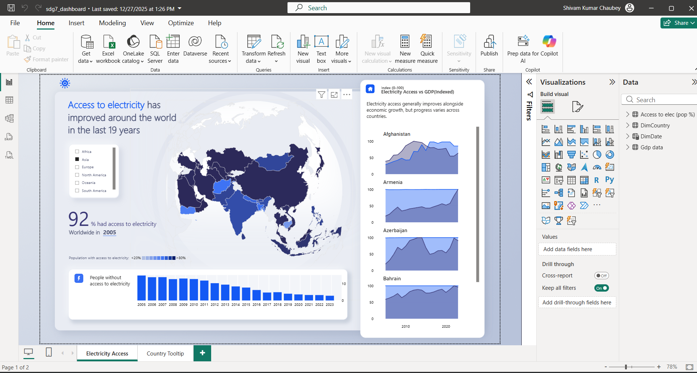

# Global-electricity-access-dashboard
# Global Electricity Access Analysis Dashboard

## Project Overview

This Power BI dashboard analyzes global electricity access trends from 2005–2023 across multiple countries and regions.

The dashboard helps visualize:

- Global electricity accessibility
- Country-wise comparison
- Regional analysis
- Historical trends
- Interactive drill-through insights

---

## Tools Used

- Power BI
- Power Query
- DAX
- Data Modeling

---

## Features

- Interactive world map
- Region filters
- Country drill-through
- KPI cards
- Custom tooltips
- Trend analysis

---

## Dashboard Preview

---

## Key Insights

- Global electricity access improved significantly over time.
- Regional disparities still exist.
- Certain developing countries showed rapid growth in electrification.

---

## Skills Demonstrated

- Data Cleaning
- Data Transformation
- DAX
- Data Visualization
- Dashboard Design
- Business Intelligence
